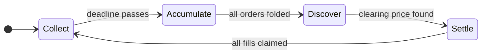
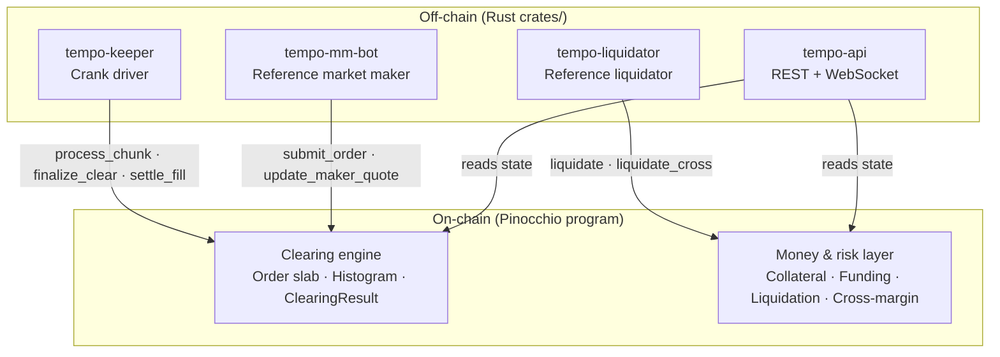

# Tempo

An open-source **Dual Flow Batch Auction (DFBA)** perpetuals DEX on Solana.

Instead of matching trades one by one as they arrive — rewarding whoever has the fastest connection and giving bots a speed edge — Tempo collects orders over a short window and clears them all together at a single uniform price. Speed inside the window confers no advantage; the race disappears and competition shifts back to price.

The on-chain mechanism is Jump Crypto's [DFBA design](https://jumpcrypto.com/resources/dual-flow-batch-auction). Tempo's contribution is the **first open-source, fully-settling implementation for perpetuals** - with a permissionless, trustless-crank clearing design so that the clearing operator cannot rig the price, delay fills, or censor orders.

Docs (`docs/`), in reading order:
- [`overview.md`](docs/overview.md) — plain-language "why"
- [`tempo-clearing-protocol.md`](docs/tempo-clearing-protocol.md) — the core price-histogram mechanism
- [`system-design.md`](docs/system-design.md) — architecture, account model, instruction set
- [`risk-model.md`](docs/risk-model.md) — the perpetuals money and risk layer

## How it works

Each market repeats this cycle every auction round:



- **Collect** — traders submit orders into the slab during the window
- **Accumulate** — orders are folded into a price histogram (permissionless, commutative — anyone can crank any slice in any order and the result is identical)
- **Discover** — one pass over the histogram finds the uniform clearing price and fill allocation
- **Settle** — each trader pulls their own fill; positions update, funding accrues

The histogram is fixed-size (O(ticks), not O(orders)), so clearing cost is independent of book depth and decomposes across many cheap transactions.

## System architecture



## Layout

| Path | What |
|---|---|
| `program/` | Pinocchio on-chain program — clearing engine + perpetuals money/risk layer |
| `tests/integration-tests/` | LiteSVM end-to-end + property tests |
| `clients/typescript/` | Codama-generated TypeScript SDK (`just generate-clients`) |
| `idl/tempo_program.json` | Codama IDL (written by `program/build.rs`) |
| `crates/` | Rust off-chain services (see below) |
| `docs/` | Design docs + benchmark artifacts |
| `ops/` | Docker, Compose, systemd, CI |

### `crates/` — Rust off-chain stack

| Crate | What |
|---|---|
| `tempo-math` | `no_std` mirror of the program's pure math — oracle reader, margin/liquidation, clearing, wide arithmetic |
| `common` | RPC pool with 429 failover, priority-fee tx sender, backoff, config, telemetry |
| `sdk` | `TempoClient` — typed account decoders, PDA helpers, instruction builders, `benign` race classifier |
| `keeper` | Stateless crank driver — pure `decide()` state machine drives `process_chunk` / `finalize_clear` / `settle_fill` / `start_auction` |
| `api` | Axum REST + WebSocket read API — `ArcSwap`-backed live state, no per-request RPC |
| `mm-bot` | Reference market maker — oracle-anchored, inventory-skewed maker-quote ladder |
| `liquidator` | Reference liquidator — `getProgramAccounts` scan, pure engine gates mirror on-chain math |
| `bench` | Host micro-benchmarks proving O(ticks) clearing; output in `docs/bench/` |

## Quickstart

**Prerequisites:** Rust (see `rust-toolchain.toml`), `cargo-build-sbf`, Solana CLI, Node (see `.nvmrc`), pnpm.

```bash
# On-chain program
just build             # cargo-build-sbf → target/deploy/tempo_program.so
just unit-test         # clearing math + state serde (77 tests)
just integration-test  # LiteSVM end-to-end suite (needs a built .so)
just benchmark         # CU profile → docs/bench/cu_report.md

# Off-chain Rust services
cargo build -p tempo-keeper
cargo build -p tempo-mm-bot
cargo build -p tempo-liquidator
cargo build -p tempo-api

# TypeScript client
pnpm install
just generate-clients  # IDL → clients/rust + clients/typescript
```

## Devnet

Program deployed to **Solana devnet** at `8gpzMDNnKNz422jW3hs54TRmZK2H5uEwgfEQbjWAwnJD`, integrating the live **Pyth SOL/USD** push feed (`7UVimffxr9ow1uXYxsr4LHAcV58mLzhmwaeKvJ1pjLiE`).

The `read_oracle` instruction parses `PriceUpdateV2` on-chain (owner + feed-id + staleness + confidence checks) and derives the mark price. The full perpetuals money path — collateral custody, deposit/withdraw, oracle-priced funding, liquidation, cross-margin — is live and was exercised against the real Pyth feed.

All three Rust off-chain services (`tempo-keeper`, `tempo-mm-bot`, `tempo-liquidator`) have been smoke-tested against live devnet.

```bash
# Redeploy after program changes
cargo-build-sbf
solana program deploy target/deploy/tempo_program.so \
  --program-id target/deploy/tempo_program-keypair.json

# Run the Rust services (requires TEMPO_RPC_URL, TEMPO_KEYPAIR, TEMPO_MARKET in env or tempo.toml)
just keeper
just mm
just liq
```

## Status

**Working today:**

- The **clearing engine** — dual auction (bid + ask), three-phase ACCUMULATE → DISCOVER → SETTLE, auction lifecycle, CPI events
- The **money/risk layer** (`docs/risk-model.md`) — SPL collateral custody, deposit/withdraw, oracle-priced funding and liquidation, insurance fund, open-interest tracking, socialized-loss/ADL, hard solvency gate, per-slot price brake, oracle soft-stale fallback, overflow-safe notional math, cross-margin
- **Verification** — LiteSVM end-to-end suites including randomized multi-round and liquidation stress tests, property fuzzes, and formal proofs (`cargo kani`)
- **Off-chain Rust stack** — keeper, market maker, liquidator, read API — all smoke-tested on live devnet
- **Deployed to devnet** at `8gpzMDNnKNz422jW3hs54TRmZK2H5uEwgfEQbjWAwnJD`; the money path and full auction lifecycle are exercised against the real Pyth feed. In-place account migration handles layout upgrades.

**Still open before mainnet:**

- **Throughput benchmark** — measuring max orders per auction under Solana's per-account write-lock budget and whether histogram sharding is needed (`system-design.md §7`, `docs/bench/`)
- **Dual-auction end-to-end on devnet** — implemented and tested in LiteSVM; not yet driven fully on live devnet
- **Indexer + web UI** — deferred; API history endpoints return 501 until the indexer lands
- **Economic hardening** — batch-perp funding stability, true OI-netted PnL (see `docs/risk-model.md`)

Known issues and open design questions are tracked in [`docs/known-issues.md`](docs/known-issues.md) and [`docs/missing-features.md`](docs/missing-features.md).

## Contributing

See [`CONTRIBUTING.md`](CONTRIBUTING.md).

## License

MIT — see [`LICENSE`](./LICENSE).
