# Tempo — System Design

*A fully on-chain batch-auction perpetuals DEX on Solana L1.*

The spine of the system is **three-phase histogram clearing** ("the mailbox method"):
the order book is folded into a fixed-size price histogram, the clearing price is found in
one bounded pass, and each trader pulls their own fill. Read this together with
`tempo-clearing-protocol.md`, which has the mechanism and its test results, and
`risk-model.md` for the money layer.

> **Status note.** This is the *design rationale*, parts of which were written before the
> code. Where a section is marked 🔴 "open" or describes something as future, the clearing
> engine and the perpetuals money/risk layer are in fact **implemented, tested, and
> deployed to devnet** — margin, oracle-priced funding, liquidation, insurance, open
> interest, socialized-loss/ADL, a hard solvency gate, a per-slot price brake, oracle
> soft-stale fallback, overflow-safe notional math, and cross-margin. See `README.md` for
> current build status and `risk-model.md` for the as-built risk layer. The throughput
> questions in §7 (histogram write-lock contention, the period clock, and the maximum
> orders per auction) were the genuine open research items when this was written; **they
> have since been substantially answered by the scaling work in `docs/plan.md`** — the
> order book is sharded (Stage A), unfilled orders rest across rounds instead of being
> discarded (Stage B), and order submission is always-open (Stage C1). See §6.3, §7, §8,
> and §14 below (each carries an updated note) and `docs/design-decisions.md` (DDR-1..DDR-4)
> for the detailed reasoning; `docs/bench/cu_report.md` has the measured numbers. The one
> remaining deliberately-deferred piece is true round-*processing* overlap (Stage C2 —
> `docs/known-issues.md` §2.14), gated behind a benchmark showing it's actually needed.

**Confidence levels used throughout:**
- 🟢 **Confident** — standard, well-understood, safe as described.
- 🟡 **Reasoned but unverified** — logic is sound but needs a prototype or measurement.
- 🔴 **Open problem** — genuinely unsolved or unverifiable without building it. The real risk lives here.

---

## 0. What this design is based on

Tempo implements the **Dual Flow Batch Auction (DFBA)** mechanism described by Jump Crypto
(2025). Two facts shape everything:

1. **It's a *dual* auction — two clearing prices per round.** Each period runs two
   independent auctions: a *bid auction* (maker-buys vs taker-sells) and an *ask auction*
   (maker-sells vs taker-buys). Makers never match makers; takers never match takers. Each
   clears at its own single price.
2. **The mechanism leaves the implementer the rest:** how orders are designated maker vs
   taker, the finer points of clearing, and — crucially — everything specific to running
   it on Solana L1: who triggers each auction without being trusted, how clearing fits the
   compute and write-lock limits, and the full perpetuals money layer (margin, funding,
   liquidation). Those are what this design specifies.

---

## 1. The clearing breakthrough — the spine of the system 🟢 (price math tested) / 🔴 (systems integration)

The hardest worry in every earlier draft was: *a uniform-price auction must look at every order at once to find the fair price, and that doesn't fit in one L1 transaction.* That worry now has a credible, simulation-tested answer. Full detail and test results are in `tempo-clearing-protocol.md`; here is the shape, because the whole account/instruction design hangs off it.

**The insight ("mailboxes"):** the fair clearing price can be found from the *cumulative quantity at each price*, never needing all orders in memory together. So represent the book as a **fixed-size histogram over price ticks** — one bucket per tick, holding total buy and sell quantity at that tick. The histogram size depends on the tick count, **not on how many orders exist.** That single fact decouples cost from order count and is what makes L1 clearing possible.

**Clearing becomes three kinds of cheap, bounded transactions:**

- **Phase 1 — ACCUMULATE (many txs, permissionless).** Orders are folded into the histogram a bounded slice at a time. Each tx touches a few orders + the fixed histogram → bounded cost. Repeat until every active order is folded in.
- **Phase 2 — DISCOVER (one tx, permissionless).** A single pass over the buckets finds the clearing price, the matched volume, and the per-tick fill allocation. Cost depends on tick count, not order count.
- **Phase 3 — SETTLE (each user, permissionless to trigger).** Fills are **pulled, not pushed**: each user claims their own fill in their own transaction, paying their own write cost. This sidesteps the "write hundreds of positions at once" wall and spreads writes across many different accounts.

**Two properties that were tested (see clearing doc):**
- 🟢 **Order-independence.** Folding orders into buckets is integer addition, which is commutative — so whoever triggers clearing, in whatever order or chunking, gets the identical price. *A hostile cranker cannot rig the price by sequencing.* This is a strong, demonstrable security property, gained for free.
- 🟡 **Completeness must be enforced.** The only remaining power a cranker has is to *omit* an order (dropping one changed the price ~19% of the time in simulation). So the program must refuse to finalize until every active order has been folded in exactly once — and because accumulation is permissionless, any honest party (including the order's owner) can always include a censored order. This bookkeeping is the real security surface and is where an auditor must focus.

**Still open (🔴, carried in §6):** histogram write-lock contention, the period clock when a clear spans multiple slots, and lazy-settlement vs. margin safety. These are systems-integration problems, not price-math problems.

---

## 2. Sealed orders (commit–reveal): not used 🟢 (decision settled)

Orders are submitted **in the clear**, not sealed via commit–reveal:
- The batch mechanism itself removes the MEV sealing would target — no time priority, one uniform price, makers can't hit makers. Seeing the forming book buys an attacker almost nothing.
- Sealing roughly triples the transactions per order (commit, reveal, then clear) against a ~400ms slot, and adds griefing vectors (commit-but-don't-reveal).

Sealing stays a research extension only if a real attack shows up later.

---

## 3. Auction period timing 🟢

A true 100ms period (the paper's ideal) is impossible on L1 (~400ms slots). A realistic period is **one auction every 1–2 slots (~400–800ms)**, which is still inside the paper's own stated acceptable range (100ms–1s). Confident this is fine. (The interaction between period length and how long a multi-tx clear takes is the open problem in §6.)

---

## 4. Architecture overview 🟢

Three layers, and the program trusts none of the off-chain ones:

1. **On-chain program(s)** — the source of truth: holds collateral, accepts orders, runs the three-phase auction, settles fills, manages margin and liquidations.
2. **Permissionless crank network** — anyone can send accumulate/discover transactions and earn a fee. Not trusted (and, per §1, can't manipulate the price). Redundant: run several; if one stalls, anyone resumes.
3. **Keepers + indexer (untrusted)** — market-maker bots submit orders; liquidator bots trigger liquidations; an indexer (PostgreSQL + Drizzle + BullMQ via Helius/Yellowstone gRPC) reconstructs state for UI/analytics.

### 4.1 High-level system diagram

All components and how they connect. Solid lines are transactions / CPIs; dashed lines are reads (RPC / gRPC / oracle).

```mermaid
flowchart TB
    subgraph clients["Off-chain (untrusted)"]
        direction TB
        trader["Traders / UI"]
        crank["Crank fleet<br/>(apps/bots: crank.ts)"]
        mm["Market-maker bot<br/>(market-maker.ts)"]
        liq["Liquidator bot<br/>(liquidator.ts)"]
        indexer["Indexer<br/>Yellowstone/Helius gRPC → BullMQ<br/>→ Postgres + Drizzle"]
        sdk["Generated SDKs<br/>(Codama: clients/typescript + clients/rust)"]
    end

    subgraph chain["Solana L1 — tempo-program (Pinocchio)"]
        direction TB
        entry["entrypoint<br/>(1-byte discriminator router)"]
        subgraph ix["Instructions"]
            direction LR
            initm["initialize_market(0)"]
            submit["submit_order(1)"]
            cancel["cancel_order(2)"]
            chunk["process_chunk(3)<br/>Phase 1 ACCUMULATE"]
            fin["finalize_clear(4)<br/>Phase 2 DISCOVER"]
            settle["settle_fill(5)<br/>Phase 3 SETTLE"]
            roll["start_auction(6)"]
            initp["init_position(7)"]
            emit["emit_event(228)"]
        end
        subgraph math["Pure math (no_std, unit-tested)"]
            direction LR
            clearing["clearing.rs<br/>find_cross / compute_fill"]
            markmod["mark.rs"]
            fundmod["funding.rs"]
        end
        subgraph state["State PDAs (zero-copy)"]
            direction LR
            market["Market"]
            hist["AuctionHistogram<br/>(4 region buckets)"]
            slab["OrderSlab / Order"]
            clr["ClearingResult"]
            pos["Position"]
        end
        vault["tempo-collateral vault<br/>holds USDC, moves funds"]
    end

    oracle["Pyth pull oracle"]

    trader --> sdk
    mm --> sdk
    crank --> sdk
    liq --> sdk
    sdk --> entry
    entry --> ix

    submit --> slab
    cancel --> slab
    chunk --> slab
    chunk --> hist
    fin --> hist
    fin --> clr
    fin --> clearing
    settle --> clr
    settle --> slab
    settle --> pos
    roll --> market
    initp --> pos
    ix --> market

    settle -. funding/mark .-> fundmod
    fin -. mark .-> markmod
    fin -. fee/settle .-> vault
    settle -. updates collateral .-> vault
    oracle -. price .-> fin
    oracle -. price .-> liq

    ix -- CPI --> emit
    emit -. logs .-> indexer
    indexer -. serves .-> trader
    crank -. polls phase .-> market
    mm -. reads .-> market
```

**Reading the auction loop:** `submit_order` fills the `OrderSlab` during `Collect`; the **crank fleet** drives `process_chunk` (folds orders into the `AuctionHistogram`), then `finalize_clear` (runs `find_cross`, writes `ClearingResult`), then `settle_fill` per order (pulls fills, applies them to `Position`); `start_auction` rolls to the next round. Every state-changing instruction emits a CPI event that the **indexer** decodes. The program trusts none of the off-chain components — correctness comes from commutativity + the completeness check (§1, `tempo-clearing-protocol.md §4`).

> **Diagram note (predates Stage A/B/C1 and the money-path instructions).** This diagram was drawn early and shows one `OrderSlab` per market and a `submit_order` gated to `Collect`; both are now out of date (see §6.3, §8, and `CLAUDE.md`'s module map for the current, accurate picture) — `OrderSlab` is `num_slab_shards` independent shard accounts fed by a matching `InitShard`/`ResetShard` pair, and `submit_order`/`cancel_order` are always-open, not `Collect`-gated. It also predates the money path, cross-margin, and maker-quote instructions entirely. Kept as a high-level orientation diagram, not a literal current account/instruction map.

---

## 5. Program split — one program or two? 🟡

**Lean: two programs** — `tempo-core` (orders, auction, positions, margin, liquidation) and `tempo-collateral` (the vault that holds USDC and is the only thing that moves funds). Splitting shrinks the money-touching audited surface and lets trading logic upgrade without touching the vault.

🟡 **But decide with the throughput benchmark.** Two programs add cross-program-call cost on the hot path. If that cost bites, collapse to one program with tight internal boundaries.

---

## 6. Account model (Pinocchio, zero-copy) 🟢 structure / 🟡 sizes

**Framework decision (settled): the on-chain program is written in [Pinocchio](https://github.com/anza-xyz/pinocchio), not Anchor.** Reasons: (1) the clearing path is compute-bound — `process_chunk` runs hundreds of times per auction, so every CU matters, and Pinocchio's `no_std`, zero-copy, zero-dependency model removes Anchor's per-instruction overhead; (2) the histogram and order slab are large fixed-layout buffers best accessed as zero-copy `#[repr(C)]` structs (pointer-cast reads, in-place mutation) rather than deserialized; (3) it forces explicit, auditable account validation, which is exactly the security surface §1 flagged. Client SDKs are still generated from a **Codama** IDL (derived from `CodamaInstructions`/`CodamaAccount` macros), so the TS/Rust client experience is unchanged. The repo follows the canonical Pinocchio per-instruction layout.

All accounts are PDAs with a 1-byte type discriminator + 1-byte version prefix (zero-copy after the prefix). Sizes finalized against real layouts later.

### 6.1 Global
- **`Exchange`** (singleton): admin authority (multisig), fee config, pause flags, collateral mint, global risk params. Rarely written → not a bottleneck.

### 6.2 Per market
- **`Market`**: oracle ref, current auction id + phase + phase-deadline slot, last round's bid-fill and ask-fill prices, mark price, funding state, open interest, risk params (max leverage, maintenance margin, max order size, **orders-per-auction cap**), fee params. Written each round → a write-lock consideration (§7).
- **`AuctionHistogram`** (the mailboxes): fixed-size buckets of buy/sell quantity per price tick for the round being cleared, plus an accumulated-order counter for the completeness check. **Size depends on tick count, not order count** — this is the key structure from §1. May need sharding (§7).
- **`ClearingResult`**: small, fixed-size output of Phase 2 — the clearing price(s), matched volume, and per-tick allocation constants each user reads to self-compute their fill.

### 6.3 Order storage 🟢 (decided and shipped: sharded)
A self-balancing order tree (as a *continuous* order book uses) is optimized for constant insert/cancel/local-match churn. A batch auction only reads the book at the clearing instant, so a simpler structure serves better:
- A **bounded slab of order slots per market** with a hard **orders-per-auction cap per shard** (`orders_per_auction_cap ≤ 90`, sized so one shard fits a single CPI `CreateAccount` at the final `ORDER_LEN = 112`). Orders rest here; Phase 1 folds them into the histogram; Phase 3 either consumes a fully-filled/expired order or re-arms an unfilled/partial one to rest into the next round (Stage B, §3.6 there is now the resting-orders design in `docs/plan.md`).
- **Decided (Stage A, `docs/design-decisions.md` DDR-1): shard across `num_slab_shards` accounts**, not one slab. This was exactly the §7 contention trade-off this section deferred — measurement (and a wedge bug found in the first sharded prototype's aggregate counter) settled it: sharding wins decisively on submission/settlement parallelism (`submit_order`/`cancel_order`/`settle_fill` touch only their own shard, `Market` stays read-only on submit/cancel) at the cost of `finalize_clear` needing every shard account as a trailing account to prove completeness (an O(shards) cost, not O(orders) — see `docs/bench/cu_report.md`). `num_slab_shards` is a per-market `initialize_market` parameter (the scaling knob — dev default 16, raise it for a bigger book) and shards are created one-per-tx via a separate `InitShard` instruction (a market can have more shards than fit one transaction's account budget for `initialize_market` itself).

### 6.4 Positions & collateral
- **`Position`** (per market, per user): size, entry price, allocated collateral, last funding index seen, PnL bookkeeping. Written when the user settles a fill or funding applies — spread across users, not one hot account.
- **`CollateralVault`** (token account owned by `tempo-collateral`): holds USDC.
- **`UserCollateral`** (per user): deposited balance and margin locked across markets.

---

## 7. The compute & write-lock reality — the make-or-break section 🟡 (now measured; one item still deferred)

Still the most important section, but the picture is better than a single-transaction clear because clearing no longer needs the whole book in one tx — and, since the Stage A/B/C1 scaling work (`docs/plan.md`), the throughput questions below have moved from open research to measured numbers with one deliberately deferred follow-up.

**Verified Solana limits (as of April 2026):**
- 1,400,000 CU per transaction (hard cap).
- 12,000,000 CU of writes per account per block.
- 64 MiB loaded account data per transaction.
- 60,000,000 CU block limit.
- 10,240 bytes max data increase per `CreateAccount`/realloc CPI — this is what caps a single `OrderSlab` at ~90 orders (`ORDER_LEN = 112`), the hard ceiling sharding was built to work around.

**What the clearing breakthrough fixed:** per-transaction cost and the persistent clearing state are now bounded by tick count, not order count. Position writes are sharded across users (each pays their own). So the old "write hundreds of positions in one tx" wall is gone by design.

**What was open, now measured (`docs/bench/cu_report.md`, vs. the pre-shard baseline `cu_report_pre_shard.md`):**
- 🟡 **Histogram write-lock contention — bounded, not eliminated.** The order book is sharded (`docs/design-decisions.md` DDR-1) into `num_slab_shards` independent `OrderSlab` accounts, so submission and settlement are fully parallel (they touch only their own shard; `Market` and the histogram are untouched). The one histogram account is still shared and still written by Phase-1 accumulate txs, but now bounded to ≤`num_slab_shards` such txs per round rather than one per order — a sharded-*histogram* design (summed at discover) was considered and not needed once the *order book* was sharded. Measured: at 16 shards × 90-order cap, `finalize_clear`'s per-shard completeness scan (the analogous O(shards) cost on the discover side) adds ~160,542 CU total, 11.5% of the 1.4M CU/tx cap.
- 🟡 **Period clock vs. clear duration — the submission half is resolved, the processing half is deferred.** Stage C1 (always-open submission, DDR-4) means a user is never blocked from submitting regardless of what phase the round is in — the "book frozen, can't submit" version of this problem is gone. Two rounds still cannot *process* (accumulate/discover/settle) concurrently — there is one histogram and one `ClearingResult` per market — so a slow clear still lengthens that round. True processing overlap (double-buffered per-round histograms, Stage C2) is designed on paper (plan §4.2) but intentionally not built; see `docs/known-issues.md` §2.14 for the gating condition.
- 🟢 **Maximum orders per auction — measured, and now a tunable, not a hard ceiling.** A single `OrderSlab` is capped at ~90 orders by the 10,240-byte `CreateAccount` limit; sharding makes the *market's* effective cap `num_slab_shards × 90`, chosen at `initialize_market` time (dev default 16 shards ⇒ 1,440 orders/round; raise the shard count for more). `docs/bench/cu_report.md` also shows folding compute is not the real constraint (~178 CU/order — a single chunk tx could fold ~7,800 orders before hitting the 1.4M CU/tx cap); the account-size ceiling, not compute, was always the binding limit, and sharding is the fix for it.

These numbers are committed in `docs/bench/cu_report.md` (this measurement is done, not outstanding); the one genuinely open follow-up is whether Stage A + C1 throughput is sufficient in practice, which would decide whether Stage C2 (round-processing overlap) or OI-sharding (the `Market` OI write still serializes `settle_fill` across shards) are worth building — see `docs/known-issues.md` §2.14 and `docs/plan.md` §2.6.

---

## 8. Instruction set 🟢

**User/trading:**
- `deposit` / `withdraw` — withdraw checks margin across all positions (isolated) or the combined group (cross-margin, `withdraw_cross`).
- `submit_order` — place a taker order into a client-chosen shard (`shard_id`); writes only that shard. **Always-open (Stage C1, DDR-4):** accepted in any phase, not just `Collect` — an order submitted mid-round is tagged for the next round instead of being rejected. Rejected only at the per-*shard* auction cap (`orders_per_auction_cap ≤ 90`), never by the phase.
- `cancel_order` — remove a resting order from its shard; **always-open**, symmetric with `submit_order`. Also permissionlessly callable by anyone (not just the owner) once the order has expired — a "reaper" cleanup path; margin always returns to the original owner.

**Auction (permissionless, the three phases):**
- `process_chunk` (Phase 1) — fold a bounded slice of one shard's resting orders into the shared histogram; mark them accumulated. Callable by anyone, any number of times, per shard.
- `finalize_clear` (Phase 2) — only succeeds once the completeness check passes, now proven per shard by scanning every `OrderSlab` shard account passed in (Design Z, DDR-1 — no `Market`-level aggregate counter); does the bucket pass; writes `ClearingResult`. Pays the caller a fee.
- `settle_fill` (Phase 3) — caller updates exactly one order's outcome: a fully-filled or expired order updates the trader's position and leaves the book (`Consumed`); an unfilled/partial order updates the position for the filled slice and **re-arms `Resting`** to carry the remainder into the next round (Stage B). Each user pays their own compute.
- `reset_shard` — permissionless, one shard per tx: once a shard's settle work is done (no order left mid-settle), frees its `Consumed`/`Empty` slots, keeps `Resting` survivors in place, and marks the shard ready for the next round. `start_auction` rolls the market to `Collect` once every shard has been reset. `init_shard` creates one shard PDA per tx at market setup (or to grow a market's shard count later).

**Funding & liquidation:**
- `update_funding` — applies funding between longs and shorts. 🔴 formula is an open design question (§9).
- `liquidate` — permissionless; closes an underwater position for a fee. 🔴 timing/pricing interacts with batch auctions (§9).

**Admin (multisig only):** `initialize_exchange`, `initialize_market`, `update_market_params`, `set_pause`, `update_oracle_config`.

---

## 9. Perpetuals-specific mechanics — the genuinely unsolved part 🔴

The paper is spot. Perps add mark price, funding, and liquidation, and **no proven public design exists for a batch-auction perp.** Proposals below are hypotheses to simulate, not answers.

### 9.1 Mark price 🟡
Two clearing prices per round (bid-fill, ask-fill) plus the oracle. Proposal: mark = a function of the round's clearing prices (e.g. midpoint when both exist) anchored to the oracle within a band, falling back to the oracle when a side didn't clear. 🟡 The two-price feature makes edge cases (one side empty, wide divergence) less clean than a single-cross design; not fully validated.

### 9.2 Funding rate 🔴
Normally based on the mark-vs-oracle gap over continuous time; here time is discrete and there are two prices. Proposal: accrue per period from (mark − oracle)/oracle scaled by period length. **Not confident it's stable** — batch perps may have oscillations or boundary-gaming I haven't modeled. Simulate before building.

### 9.3 Liquidation 🔴
A position can go underwater between auctions, but the venue only makes prices at clears — which now also span multiple transactions. So liquidation probably **cannot** wait for an auction price. I now lean fairly firmly toward **oracle-priced liquidation handled independently of the auction**, backed by an insurance fund. This is a core safety mechanism; getting it wrong causes bad debt. Must be designed with an auditor.

### 9.4 Insurance fund 🟢
Standard and necessary: protocol-owned, absorbs bad debt, funded by a fee cut + liquidation penalties. Also absorbs the small integer-rounding dust from fill allocation (clearing doc §6).

---

## 10. Oracle integration 🟢
**Pyth pull oracle** (`pyth-solana-receiver-sdk`): a fresh price posted alongside the auction; enforce `get_price_no_older_than`, confidence bounds (halt/widen if confidence too wide), and sanity bounds. Used for funding, mark-price anchoring, and liquidation (§9.3). Switchboard On-Demand as redundancy.

---

## 11. Security model 🟢 principles / 🟡 perp-specific
- **No floating point** — fixed-point u64/u128, checked arithmetic, round against the user. 🟢
- **Clearing determinism + commutativity** is now a *tested* security property (§1): the cranker can't rig price by sequencing. 🟢 for the math; 🟡 for the completeness/anti-censorship bookkeeping, which the auditor must scrutinize.
- **Authority** behind a Squads multisig; verifiable builds via `solana-verify`; Immunefi bounty before mainnet. 🟢
- **Funding and liquidation** are the perp-specific danger zones (§9). 🔴

---

## 12. Off-chain components 🟢
- **Crank fleet:** sends `process_chunk` / `finalize_clear` each period, posts the oracle update, lands with a Jito tip. Permissionless and redundant; whoever lands first earns the fee; a stalled clear is resumable by anyone.
- **Market-maker bot:** your own first, to seed liquidity each period.
- **Liquidator bot:** watches positions, triggers `liquidate`.
- **Indexer:** PostgreSQL + Drizzle + BullMQ on Helius/Yellowstone gRPC; reconstructs book, fills, positions, funding for the UI. Your existing stack fits directly.

---

## 13. Build order (and why)

The build order is layered so the scariest parts are proven first:

1. **The clearing engine + benchmark.** The order slab + histogram +
   `process_chunk`/`finalize_clear` for one market, orders in the clear. Measure max
   orders per auction under the write-lock budget, with and without histogram sharding,
   and the per-auction cap — all *from data*.
2. **Trustless clearing.** Identical results regardless of caller, survival of an
   offline/hostile trigger party, and completeness/anti-censorship (much of the price math
   is simulation-backed — see clearing doc).
3. **Settlement + perp plumbing.** `settle_fill`, then margin, mark price, funding,
   liquidation, and the insurance fund — the §9 mechanics, simulated before trusting.
4. **Hardening.** Fuzzing + invariants, verifiable build, multisig authority, audit, docs,
   and the generated SDK.
5. **(Optional research) — sealed orders**, only if a real attack justifies it.

Steps 1–3 are implemented and tested (see `README.md`); step 4 is in progress.

---

## 14. Honest summary of what's solved vs. still open

**Solved (tested):**
- 🟢 Finding the fair clearing price without the whole book in one tx — the histogram method, simulation-tested.
- 🟢 The trigger party can't rig the price by sequencing — commutativity, tested, and unchanged by sharding the order book across it.
- 🟢 The "write hundreds of positions at once" wall — gone via pull-based per-user settlement.
- 🟢 The money/risk layer conserves — solvency invariant `vault_token ≥ Σ balances + insurance` is enforced and asserted by tests; shortfalls are socialized or fail closed, never minted.
- 🟢 Sealed orders — decided out.
- 🟢 The single-account ~90-order-per-market ceiling — gone via sharding the order book (Stage A, `docs/design-decisions.md` DDR-1); `num_slab_shards` is now the scaling knob, and completeness is proven per shard with no `Market`-level aggregate counter to drift.
- 🟢 Lazy per-user settlement vs. margin safety — resolved by the resting-order design (Stage B, DDR-2/DDR-3): margin is reserved at submit against a fixed worst-case snapshot, and a settle that would otherwise revert on a margin shortfall instead lets the trade clear and leaves the resulting position for the ordinary liquidation backstop, so a delayed or awkward settlement can never wedge the round or hide a loss.
- 🟢 Submission dead time — gone via always-open submission (Stage C1, DDR-4): users can submit in any phase; a mid-round order is simply deferred one round, with no aggregate counter and no roll-time re-arm step needed.
- 🟢 Histogram write-lock contention — bounded and measured, not merely argued: sharding the order book bounds accumulate-phase histogram writes to ≤`num_slab_shards`/round; `docs/bench/cu_report.md` has the numbers (16 shards × 90 cap ⇒ ~160,542 CU finalize, 11.5% of the 1.4M CU/tx cap).
- 🟢 Maximum orders per auction — no longer an unknown, it's a tunable: `num_slab_shards × ~90`, chosen per market at `initialize_market`; folding compute itself was shown not to be the real constraint (~178 CU/order).

**Still genuinely open (🔴):**
- True round-*processing* overlap (Stage C2 — double-buffered per-round histograms) is designed but deliberately not built; `docs/known-issues.md` §2.14 gates it behind a benchmark showing Stage A + C1 is actually insufficient. The period clock's *submission*-side dead time is already solved (Stage C1); this is the narrower remaining piece.
- OI-sharding — `Market`'s open-interest counters still serialize `settle_fill` across shards (`docs/plan.md` §2.6); deferred pending a benchmark showing it's the bottleneck.
- Funding-rate stability for a batch perp (§9.2).
- True OI-netted PnL — continuous mark-to-market between longs and shorts (today PnL is conserved through the insurance pool; continuous netting is the planned step up).

**Decide with measurement (🟡):** one program vs two (§5); order-storage sharding (§6.3); mark-price formula edge cases (§9.1); maker/taker abuse resistance.

The clearing arithmetic works and is hostile-trigger-resistant, with tests behind both
claims, and the money/risk layer conserves. The remaining gap to production is the
systems-integration and economic-hardening work above — drawn explicitly here rather than
glossed over.
